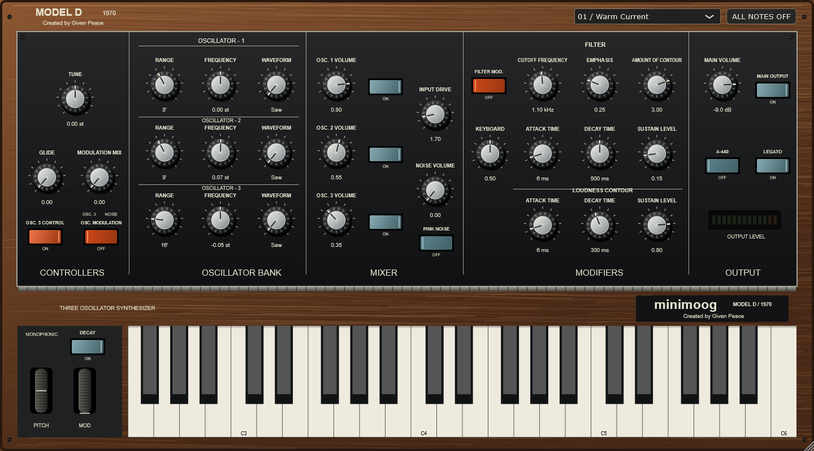

# Minimoog Model D

Created by **Given Peace**. The plugin appears in Ableton as **Model D 1970**, with **Given Peace** as its manufacturer.



A personal-use Minimoog Model D-inspired monophonic instrument, written in C++17 with JUCE 8.0.15. Windows x64 VST3 for Ableton Live, plus a standalone application. The panel is drawn natively in JUCE and follows an early Model D's walnut cabinet, black faceplate, aluminium knobs, rocker switches and five control groups.

## Play in Ableton Live

1. Download the Windows x64 ZIP from this repository's Releases page, or build locally with `scripts/build.ps1`. Copy the **whole `Model D 1970.vst3` folder** from the ZIP or local `dist` folder to `C:\Program Files\Common Files\VST3`, accepting Windows' administrator prompt. The folder is the plugin bundle; do not extract just its inner binary. Alternatively, run `scripts/install.ps1` from an administrator PowerShell after building.
2. In Live's **Settings / Preferences > Plug-Ins**, enable **Use VST3 Plug-In System Folders**, then **Rescan**.
3. Find **Model D 1970** under **Plug-Ins / Given Peace** and drag it onto a MIDI track. Arm the track and play MIDI, a piano-roll clip, or the plugin's on-screen keyboard.
4. Start with **01 / Warm Current**. The five patches are selected from the cabinet's upper-right menu. Saving your Live Set saves all synth parameters. A factory patch selection replaces current knob settings.

If the system folder is not writable, use `scripts/install.ps1 -Destination "$env:USERPROFILE\Documents\VST3"` and select that separate folder as Live's VST3 custom folder. Avoid setting a project directory as your scan folder.

## Controls

- **Controllers:** master tuning, glide, oscillator-3/noise modulation mix, oscillator modulation enable, oscillator-3 keyboard tracking.
- **Oscillator Bank:** three free-running oscillators, 32/16/8/4/2-foot and LO ranges, +/-7-semitone frequency offsets, saw/square/25%-pulse/triangle/triangle-saw/12%-pulse waves. Mixer switches mute the audio without stopping the oscillator, so oscillator 3 can remain a modulation source.
- **Mixer:** independent oscillator levels, white or Voss-McCartney pink noise, and input drive into the filter.
- **Modifiers:** nonlinear 24 dB/octave ladder low-pass; cutoff, emphasis, bipolar contour depth, variable keyboard tracking; attack/decay/sustain envelopes for filter and loudness.
- **Output:** main volume, main output switch, A440 reference tone, legato switch and output meter.
- **Performance:** lowest-held-note priority, sustain pedal (CC64), +/-2-semitone pitch bend, modulation wheel (CC1), on-screen keyboard, and all-notes-off button. Raise the modulation wheel and enable OSC. MODULATION or FILTER MOD. to hear the selected modulation mix.
- **Decay switch:** envelope decay knobs also set release time while DECAY is on; off gives a short 5 ms release. Glide applies between overlapping notes. LEGATO on avoids retriggering envelopes on overlapping notes.
- Drag knobs vertically or horizontally; mouse-wheel adjustment and double-click reset are supported. Resize the window from its lower-right corner. Values are shown below knobs. The extra independent LFO rate/pitch/filter and velocity-sensitivity parameters are available through the host's automation parameter list.

## Scope

This is an original digital approximation for personal use, not Moog software or a circuit-exact recreation. It uses JUCE's nonlinear ladder filter, PolyBLEP saw/pulse oscillators and band-limited additive triangle waves. It does not model original component tolerances, analog drift or every hardware quirk. Saturation is not oversampled; extreme drive/FM/high notes may alias. Input drive replaces the external-audio input; external audio, CV jacks and headphone output are not implemented. The graphics are drawn with C++ rather than a photograph of the hardware.

## Build and verify

Requirements: Windows x64, Visual Studio 2022 with Desktop development with C++, Windows SDK, CMake 3.22+, Git. Run:

```powershell
.\scripts\build.ps1
```

CMake uses `.deps/JUCE` if present; otherwise it fetches the exact JUCE commit `91ad83ae34a81e0833b1a2b0866f54846370ae53` (8.0.15). Build output is under `build/EmberModel3_artefacts/Release`, packaged output under `dist`.

`EmberChecks` loads the **actual VST3 bundle** in a JUCE VST3 host. It checks scanning, MIDI input, sample-offset note-on, silence, sustain/release, state recall, malformed state handling, presets at 44.1/48/96 kHz and 1/64/257/1024 sample buffers, all-sound-off, randomized parameter stability, editor creation and resizing. It also writes a 15-second WAV and two screenshots to `dist`. This is an offline host test; an Ableton session test must be reported separately.

The Release build passed these checks on October 7, 2026, including C4 tuning, lowest-note priority, held-note fallback and two-semitone pitch bend. The local build writes the full test log to `dist/Validation.txt`. The panel screenshots were visually inspected. No playback inside Ableton Live has been verified yet.

## References and dependencies

- [Early Model D photo used as a visual reference](https://www.matrixsynth.com/2015/06/rare-early-model-moog-minimoog-model-d.html). The photo is not embedded in the plugin or distributed in this repository.
- [JUCE CMake API](https://github.com/juce-framework/JUCE/blob/8.0.15/docs/CMake%20API.md).
- [Ableton: using VST plug-ins on Windows](https://help.ableton.com/hc/en-us/articles/209071729-Using-VST-plug-ins-on-Windows).

JUCE is provided under its own AGPLv3/commercial licensing terms; see `.deps/JUCE/LICENSE.md`. Third-party notices are in that dependency. Moog and Minimoog names identify the requested historical reference; this project is unaffiliated with Moog Music.
